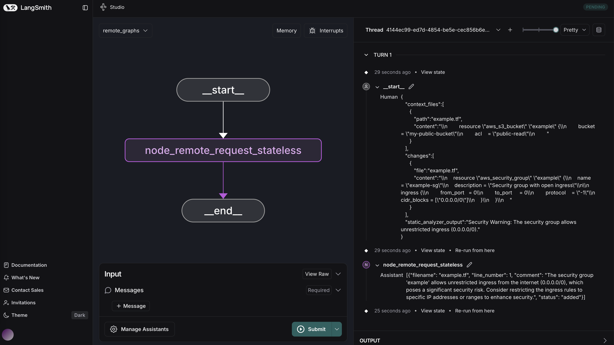

# Terraform Code Reviewer AI Agent
[](CHANGELOG.md)
[](CODE_OF_CONDUCT.md)

Application of OpenAI to review Terraform code in Pull Requests for key issues.

## Overview
The **Terraform Code Reviewer AI Agent** conforms to AGNTCY specs as described https://github.com/agntcy.

This langchain agent takes as input: (1) the diff patch file from the Pull Request (PR) to be reviewed, (2) the other files in the directories of the files getting modified in the PR, and (3) [optional] the output of the code analyzer (linter) agent (see https://github.com/cisco-outshift-ai-agents/tf-code-analyzer-agntcy-agent).

All input is reviewed against a set of Terraform problem areas and best practices with a [prompt](app/utils/chain.py) sent to OpenAI.

By leveraging AI, the agent provides actionable insights for changes made in a PR, and makes recommendations on how to resolve any issues identified and improve Terraform code quality, security, and reuse.

This agent can be used by developers who are building GenAI agentic applications that would benefit from insertion of a Terraform PR reviewer assistant.

The **Terraform Code Analyzer AI Agent** delivers value to agentic application developers by saving the effort of writing code to take diff files from a pull request, linter feedback, and then construct an effective code review prompt by providing an out-of-the-box solution that can be easily inserted into agentic applications via its supported APIs.

## **📌 About the Project**
This repository contains a **Terraform Code Reviewer AI Agent** Protocol FastAPI application. It also includes examples of JSON-based logging, CORS configuration, and route tagging.

This application supports **both REST and AGP** (Agent Gateway Protocol) interfaces out of the box.

> ℹ️ **Both REST and AGP servers run concurrently.** AGP is launched as a background task inside FastAPI's startup lifecycle.

This project is part of the [**AGNTCY**](https://docs.agntcy.org/pages/introduction.html) initiative — an open source collective building the infrastructure for the **Internet of Agents (IoA)**: a secure, interoperable layer for agent-to-agent collaboration across organizations and platforms.

## Requirements

- Python 3.12+
- A virtual environment is recommended for isolating dependencies.

## Installation

1. Clone the repository:

   ```bash
   git clone https://github.com/cisco-outshift-ai-agents/tf-code-reviewer-agntcy-agent
   cd tf-code-reviewer-agntcy-agent
   ```

2. Install the dependencies:

   ```bash
   pip install -r requirements.txt
   ```

## Environment Setup

Before using the agent, you need to configure **API keys** for OpenAI or Azure OpenAI.

### **1️⃣ Create a `.env` File**

```sh
touch .env
```
> 📄 A sample `.env.example` is provided to help you configure your environment.  
> Copy it to `.env` and modify values accordingly:
> 
> ```bash
> cp .env.example .env
> ```

### **2️⃣ Add API Keys**

#### **✅ OpenAI API Configuration**

```
OPENAI_API_KEY=your-openai-api-key-here
OPENAI_MODEL_NAME=gpt-4o
OPENAI_TEMPERATURE=0.7
...
```

#### **✅ Azure OpenAI API Configuration**

```
AZURE_OPENAI_API_KEY=your-azure-api-key-here
AZURE_OPENAI_ENDPOINT=https://your-resource-name.openai.azure.com
AZURE_OPENAI_DEPLOYMENT_NAME=gpt-4o
AZURE_OPENAI_API_VERSION=2025-01-01-preview
...
```

---

## Running the Application

## AGP Gateway Setup

Before starting this service, make sure the **AGP Gateway** is up and running.

- Default endpoint: `http://127.0.0.1:46357` on your machine.
- This agent registers itself with the gateway using the agent ID `tf_code_reviewer`.

### Server

You can run the application by executing:

```bash
cd app

python main.py
```

### What happens on startup:

- Environment variables are loaded.
- A LangChain-based Terraform Code Reviewer is initialized.
- The FastAPI rest server starts on port `8123`.
- The AGP server is started asynchronously on port `46357` **after** FastAPI has initialized.

### Expected Console Output

On a successful run, you should see logs in your terminal similar to the snippet below. The exact timestamps, process IDs, and file paths will vary:

```bash
python main.py
{"timestamp": "2025-03-22 13:02:52,551", "level": "INFO", "message": "Logging is initialized. This should appear in the log file.", "module": "logging_config", "function": "configure_logging", "line": 158, "logger": "app", "pid": 6202}
{"timestamp": "2025-03-22 13:02:52,552", "level": "INFO", "message": ".env file loaded from /Users/jasvdhil/Documents/Projects/subagents/tf-code-reviewer-agntcy-agent/.env", "module": "main", "function": "load_environment_variables", "line": 71, "logger": "root", "pid": 6202}
{"timestamp": "2025-03-22 13:02:52,552", "level": "INFO", "message": "Starting FastAPI application...", "module": "main", "function": "main", "line": 297, "logger": "app", "pid": 6202}
INFO:     Started server process [6202]
INFO:     Waiting for application startup.
{"timestamp": "2025-03-22 13:02:52,580", "level": "INFO", "message": "Starting TF Code Reviewer Agent...", "module": "main", "function": "lifespan", "line": 138, "logger": "root", "pid": 6202}
{"timestamp": "2025-03-22 13:02:52,580", "level": "INFO", "message": "Using Azure OpenAI GPT-4o for Code Review.", "module": "main", "function": "initialize_chain", "line": 94, "logger": "root", "pid": 6202}
{"timestamp": "2025-03-22 13:02:52,626", "level": "INFO", "message": "Starting AGP application...", "module": "main", "function": "start_agp_server", "line": 269, "logger": "app", "pid": 6202}
INFO:     Application startup complete.
INFO:     Uvicorn running on http://0.0.0.0:8123 (Press CTRL+C to quit)
{"timestamp": "2025-03-22 13:02:52,637", "level": "INFO", "message": "AGP Server started for agent: cisco/default/<bound method AgentContainer.get_local_agent of <agp_api.agent.agent_container.AgentContainer object at 0x108c1e180>>", "module": "gateway_container", "function": "start_server", "line": 291, "logger": "agp_api.gateway.gateway_container", "pid": 6202}
```

This output confirms that:

1. Logging is properly initialized.
2. The server is listening on `0.0.0.0:8123`.
3. The agent has registered itself to AGP.
4. Your environment variables (like `.env file loaded`) are read.


### ⚙️ What Happens If AGP Gateway Is Not Running?

If the AGP Gateway is **not** available at startup:

- The agent will automatically **retry connection attempts** (with exponential backoff or configured retry logic).
- The retry duration is currently **10 seconds** (see `max_duration` in the code).
- If the gateway is **still unavailable** after retries:
  - ❗ **AGP integration will be skipped**
  - ✅ The agent will **still start the REST API server** normally.

This ensures graceful degradation — the agent works in REST mode even if AGP is down or unreachable.

### Client

Change to `client` folder

```bash
# REST client example
python rest.py

# AGP Client example
python agp_client.py
```

On a successful remote graph run you should see logs in your terminal similar to the snippet below:

```bash
{"timestamp": "2025-03-07 13:52:09,594", "level": "INFO", "message": "{'event': 'final_result', 'result': {'messages': [HumanMessage(content='{\"context_files\": [{\"path\": \"example.py\", \"content\": [\"\\\\n    resource \\\\\"aws_s3_bucket\\\\\" \\\\\"example\\\\\" {\\\\n    bucket = \\\\\"my-public-bucket\\\\\"\\\\n    acl    = \\\\\"public-read\\\\\"\\\\n    }\\\\n    \"]}], \"changes\": [{\"file\": \"example.py\", \"diff\": \"\\\\n    resource \\\\\"aws_security_group\\\\\" \\\\\"example\\\\\" {\\\\n    name        = \\\\\"example-sg\\\\\"\\\\n    description = \\\\\"Security group with open ingress\\\\\"\\\\n    \\\\n    ingress {\\\\n        from_port   = 0\\\\n        to_port     = 0\\\\n        protocol    = \\\\\"-1\\\\\"\\\\n        cidr_blocks = [\\\\\"0.0.0.0/0\\\\\"]\\\\n    }\\\\n    }\\\\n    \"}], \"static_analyzer_output\": \"Security Warning: The security group allows unrestricted ingress (0.0.0.0/0).\"}', additional_kwargs={}, response_metadata={}, id='968ed363-5286-4dbd-abbe-9512181524cd'), AIMessage(content=[{'filename': 'example.py', 'line_number': 2, 'comment': 'The security group allows unrestricted ingress on all ports (0.0.0.0/0), which poses a significant security risk. Consider restricting the ingress rules to specific IP addresses or ranges to enhance security.', 'status': 'added'}], additional_kwargs={}, response_metadata={}, id='a1873bf4-889e-4809-be85-1c73a8fcc3ec')]}}", "module": "rest", "function": "<module>", "line": 242, "logger": "graph_client", "pid": 54199}
```

## Logging

- **Format**: The application is configured to use JSON logging by default. Each log line provides a timestamp, log level, module name, and the message.
- **Location**: Logs typically go to stdout when running locally. If you configure a file handler or direct logs to a centralized logging solution, they can be written to a file (e.g., `logs/app.log`) or shipped to another service.
- **Customization**: You can change the log level (`info`, `debug`, etc.) or format by modifying environment variables or the logger configuration in your code. If you run in Docker or Kubernetes, ensure the logs are captured properly and aggregated where needed.

## API Endpoints

By default, the API documentation is available at:

```bash
http://0.0.0.0:8123/docs
```

(Adjust the host and port if you override them via environment variables.)


## AGP Gateway: Remote Graph Integration

This app is AGP-compliant and runs a **LangGraph agent server** behind the scenes.

A remote client (LangGraph Studio or AGP-compatible client) can send structured payloads to `/api/v1/runs`.


## Running as a LangGraph Studio

You need to install Rust: <https://www.rust-lang.org/tools/install>

Run the server

Change to `client` folder

```bash
langgraph dev
```

Paste sample input:

```json
{
   "context_files":[
      {
         "path":"example.tf",
         "content":"\\n        resource \"aws_s3_bucket\" \"example\" {\\n        bucket = \"my-public-bucket\"\\n        acl    = \"public-read\"\\n        "
      }
   ],
   "changes":[
      {
         "file":"example.tf",
         "content":"\\n    resource \"aws_security_group\" \"example\" {\\n    name        = \"example-sg\"\\n    description = \"Security group with open ingress\"\\n\\n    ingress {\\n        from_port   = 0\\n        to_port     = 0\\n        protocol    = \"-1\"\\n        cidr_blocks = [\"0.0.0.0/0\"]\\n    }\\n    }\\n    "
      }
   ],
   "static_analyzer_output":"Security Warning: The security group allows unrestricted ingress (0.0.0.0/0)."
}
```

Expected Output:




## 🛠️ How to Generate `context_files`, `changes`, and `static_analyzer_output`

The client application prepares these inputs from your GitHub Pull Request:

### 🔹 `context_files`

Contextual `.tf` files are collected from the same directories as your changed Terraform files. These provide broader context for better review.

The logic excludes `.tfstate`, `.tfplan`, and similar sensitive files by default.

### 🔹 `changes`

`changes` contains the patch diff extracted from the GitHub PR. For example:

```json
{
  "file": "example.tf",
  "diff": "resource \"aws_security_group\" ..."
}
```

Each change entry captures:
- File name
- Line numbers
- `added` or `removed` code
- Status (`added` / `removed`)

### 🔹 `static_analyzer_output` (optional)

This field contains the output of a static analyzer agent.

#### Option 1 – Recommended:

Use the official Terraform Static Analyzer Agent:

👉 [https://github.com/cisco-outshift-ai-agents/tf-code-analyzer-agntcy-agent](https://github.com/cisco-outshift-ai-agents/tf-code-analyzer-agntcy-agent)

Follow its README to run it independently and extract warnings or security insights. You can pass its output into this agent for improved analysis.

#### Option 2 – Skip

If you don't have static analyzer output, you may simply pass:

```json
"static_analyzer_output": "No issues found"
```

---

## Tests

This repository includes both **unit** and **integration** tests to validate core logic, route handling, environment loading, and full agent interactions.

Our **integration** test suite is instrumented using the [`langsmith.testing`](https://docs.smith.langchain.com/evaluation/how_to_guides/pytest) module.
The GitHub Actions workflow includes:

```yaml
env:
   LANGSMITH_TRACING: true
   LANGSMITH_ENDPOINT: ${{ LANGSMITH_ENDPOINT }}
   LANGSMITH_API_KEY: ${{ LANGSMITH_API_KEY }}
   LANGSMITH_PROJECT: ${{ LANGSMITH_PROJECT }}
```

- Each test logs:
  - Inputs sent to the agent
  - LLM responses, any expected outputs and feedback.

> These environment variables automatically log your tests to LangSmith when running `pytest` (see [`.github/workflows/test.yml`](.github/workflows/test.yml)).


### 🧪 Running Tests

Tests are orchestrated using the `Taskfile.yaml` for convenience:

#### 🔹 Run All Tests (Unit + Integration)
```bash
task test:all
```

#### 🔹 Run Only Unit Tests (requires Docker Compose)
```bash
task test:unit
```

#### 🔹 Run Only Integration Tests (requires Docker Compose)
```bash
task test:integration
```

#### 🔹 Run Tests in Local Host Environment (no Docker Compose)
```bash
task test:local
```

> `test:local` assumes AGP and the reviewer agent are already running locally, and only executes client-side integration tests.

---

### 📁 Test Directory Structure

```
tests/
├── integration/               # Full system tests using live REST/AGP endpoints
│   ├── test_agp.py
│   └── test_rest.py
└── unit/                      # Tests for internal modules, routes, and utilities
    ├── test_env_loader.py
    ├── test_lifespan.py
    ├── test_main.py
    ├── test_route_utils.py
    ├── test_stateless_runs.py
    └── test_wrap_prompt.py
```

> 📂 Browse all tests: [`tests/`](tests/)

---

### ✅ Test Coverage Summary

| 🧪 Category                      | 🔍 What It Tests                                                                                          | 🔗 Source |
|----------------------------------|------------------------------------------------------------------------------------------------------------|-----------|
| Prompt formatting (`wrap_prompt`) | Validates indentation and sectioning in prompts sent to the LLM                                           | [unit/test_wrap_prompt.py](tests/unit/test_wrap_prompt.py) |
| Chain initialization              | Ensures correct model config (OpenAI vs Azure) based on env vars                                          | [unit/test_main.py](tests/unit/test_main.py) |
| App startup logic (`lifespan`)   | Confirms that `code_reviewer_chain` is attached to the FastAPI app state                                  | [unit/test_lifespan.py](tests/unit/test_lifespan.py) |
| Stateless run route              | Validates `/api/v1/runs` POST endpoint with valid and invalid payloads                                    | [unit/test_stateless_runs.py](tests/unit/test_stateless_runs.py) |
| Route ID generator               | Tests FastAPI route ID generation via `custom_generate_unique_id()`                                       | [unit/test_route_utils.py](tests/unit/test_route_utils.py) |
| Environment loader               | Ensures `.env` files are correctly read or skipped                                                        | [unit/test_env_loader.py](tests/unit/test_env_loader.py) |
| AGP client end-to-end            | Sends request to agent via AGP and validates LLM output                                                   | [integration/test_agp.py](tests/integration/test_agp.py) |
| REST client end-to-end           | Sends input to `/api/v1/runs` and verifies structured AI feedback                                         | [integration/test_rest.py](tests/integration/test_rest.py) |

---


## Roadmap

See the [open issues](https://github.com/cisco-ai-agents/tf-code-reviewer-agntcy-agent/issues) for a list
of proposed features (and known issues).

## Contributing

Contributions are what make the open source community such an amazing place to
learn, inspire, and create. Any contributions you make are **greatly
appreciated**. For detailed contributing guidelines, please see
[CONTRIBUTING.md](CONTRIBUTING.md)

## License

Distributed under the `Apache-2.0` License. See [LICENSE](LICENSE) for more
information.

## Contact

[cisco-outshift-ai-agents@cisco.com](mailto:cisco-outshift-ai-agents@cisco.com)

Project Link:
[https://github.com/cisco-outshift-ai-agents/tf-code-reviewer-agntcy-agent](https://github.com/cisco-outshift-ai-agents/tf-code-reviewer-agntcy-agent)

## Acknowledgements

- [Langgraph](https://github.com/langchain-ai/langgraph) for the agentic platform.
- [https://github.com/othneildrew/Best-README-Template](https://github.com/othneildrew/Best-README-Template), from which this readme was adapted

For more information about our various agents, please visit the [agntcy project page](https://github.com/agntcy).
